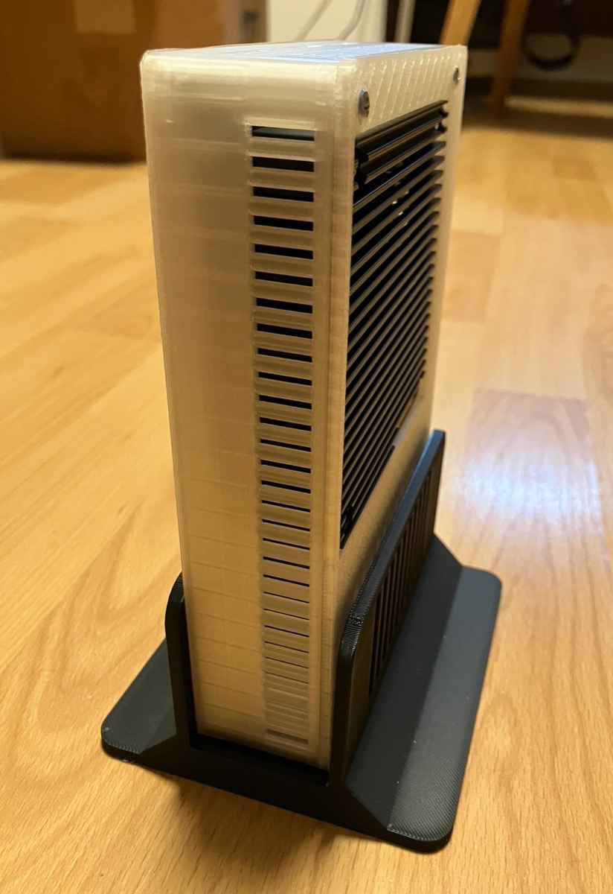
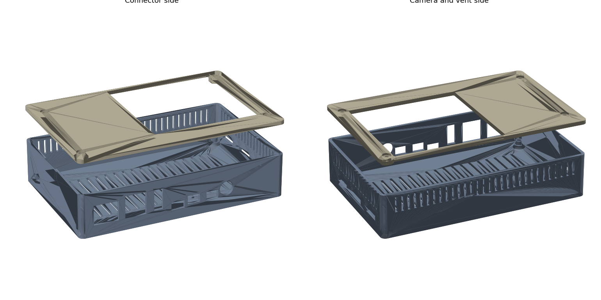
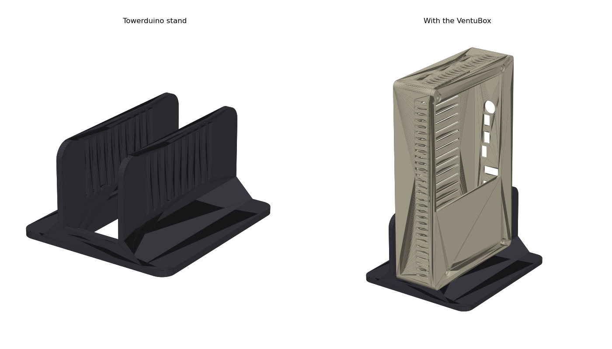
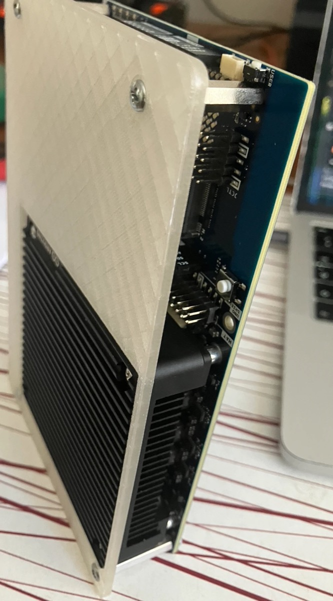

# Towerduino

A 3D-printable tower enclosure for the **Arduino VENTUNO Q** (ABX00181), with a matching vertical stand.

The box is a two-part case (base and lid) designed as parametric FreeCAD macros. Every port position was measured from Arduino's official 3D model, and the design was test-printed and fitted on a real board. The lid sits flush with the top of the board's own heatsink and fan. The stand holds the box upright like a mini PC and snaps onto the lid screw heads.

## Features

- Openings for every connector: 2.5 GbE, 2× USB-A, HDMI, USB-C, DC jack (round hole) and the screw terminal. The terminal opening is split into CAN (CAN-H, CAN-L) and power (GND, VIN), with the redundant middle GND hidden behind the wall.
- Slots for the three MIPI camera ribbon cables, a Qwiic opening and a pin hole for the user button.
- Opening in the lid for the stock heatsink and fan, with the lid top level with the fan.
- Mounts on the four corner holes using the hex standoffs: screws from below through the floor, lid screws into the standoff tops. Hex sockets under the lid stop the standoffs turning while you tighten them.
- Vent slots in the walls and floor.
- Optional knock-out window: a 20 × 10 mm panel with a 0.8 mm skin, flush with the outside of the front wall. Cut it out with a knife to route cables to the headers.
- Tower stand with vent slots in the cheeks and snap notches for the lid screw heads. Openings in the bottom edge stay clear.

| Box | Stand |
|---|---|
|  |  |

## Files

| File | What it is |
|---|---|
| `Towerduino_base.stl` | Box base, ready to print |
| `Towerduino_lid.stl` | Lid, already flipped for printing (top face on the bed) |
| `Towerduino_stand.stl` | Tower stand |
| `Towerduino_Box.FCMacro` | Parametric FreeCAD source for the base and lid |
| `Towerduino_Stand.FCMacro` | Parametric FreeCAD source for the stand |

## Hardware

| Qty | Part | Notes |
|---|---|---|
| 4 | M3 hex standoff, 25 mm, female-female | **Nylon recommended.** The corner hole next to the Qwiic connector has 0.127 mm tracks about 1.4 mm from the hole edge, inside the area a metal standoff covers. The metal standoffs that ship with the board also work, but the solder mask is all that separates them from the copper. |
| 4 | M3 × 12 screw | From below, through the floor posts and the board into the standoffs. The heads sit recessed in the floor. |
| 4 | M3 × 6 screw | Through the lid into the standoff tops. The heads sit in 1.5 mm recesses. |

The hex sockets in the lid are sized for 5.6 mm across flats. Many nylon standoffs are 5.0 or 5.5 mm, so measure yours and set `HEX_AF` in the box macro if they differ.

## Printing

The prototype was printed in transparent ABS on a QIDI printer with these settings:

- 0.4 mm nozzle; outer and inner wall line width 0.4 mm, so the 0.8 mm knock-out skin prints as exactly two lines
- Nozzle 250 °C, bed 80 °C, heated chamber 60 °C
- 5 mm brim, outer only
- No supports needed for any part
- Let the parts cool in the closed chamber before removing them

The base prints floor down and the lid prints top face down. All three parts print as exported.

## Assembly

1. Fit the four standoffs to the top of the board at the corner holes and turn them so their flats line up with the long edges of the board.
2. Place the board in the base on the four posts and screw it down from below with the M3 × 12 screws.
3. Put the lid on so the hex sockets drop over the standoffs, then fit the M3 × 6 screws.
4. Optionally stand the box in the stand on its short edge (button and Qwiic end down, camera end up). It clicks in when the lid screw heads reach the notches.

## Customizing

Open a macro in FreeCAD (Macro → Macros… → Execute). All settings are in the PARAMETERS section at the top of each file. Change them and run the macro again. Set `EXPORT_STL = True` to write new STL files next to the macro. Useful settings in `Towerduino_Box.FCMacro`:

- `DISABLED_PORTS`: close openings you don't need, for example `["CAN terminals"]` or `["Camera 2 FPC"]`.
- `KNOCKOUTS`, `KNOCKOUT_SKIN`: add, move or resize knock-out windows.
- `HEX_STANDOFF_L`, `FAN_TOP`, `HEATSINK`: adapt the box to a different standoff length or cooler.
- `HEX_AF`: across-flats size of your standoffs.
- `BOARD_STEP`: path to Arduino's STEP model to show the board inside the box for a fit check.

Tested with FreeCAD 1.1.3. The macros only use basic Part workbench shapes and should also run on 0.21.

## Credits

Board dimensions, mounting holes, connector positions and pinout come from Arduino's published [VENTUNO Q documentation](https://docs.arduino.cc/hardware/ventuno-q/) (3D model, datasheet and full pinout). This is an independent community project, not affiliated with or endorsed by Arduino. Arduino and VENTUNO are trademarks of Arduino S.r.l.

## License

[CC BY-SA 4.0](LICENSE) © 2026 Milan Riha. You may print, share and modify this design, including commercially, as long as you give credit and share your changes under the same license.
